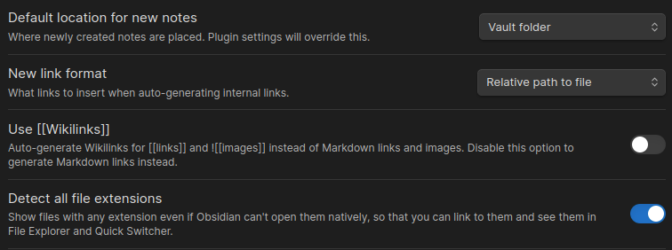

## Vault

You can try my obsidian vault, just download `.obsidian` folder and paste it into your vault.


### Structure

My main sorting relies on keeping files placed in proper folders with correct topics. This allows me to navigate manually through the folder tree. Here's an example of some of my folders:

- `Blog` — all my posts and associated materials
- `Notes` — quick items I need to remember or work on later
- `Daily posts` — ranging from daily tasks to dream journals
- `Templates` — templates for Obsidian
- `OS` — configuration settings for multiple operating systems I use
- Other topics ...
```txt
├─ blog
├─ notes
├─ daily-posts
├─ kubernetes
├─ OS
├─ ...
└─ templates
```

### Settings

My settings are configured to enable Obsidian blog usage without requiring extensive file modifications later. The focus is on maintaining markdown-compatible files, ensuring flexibility for potential transfers:
- `New link format` — when set to shortest path, it's not markdown-compatible; use absolute or relative paths (I use relative paths due to Hugo blog requirements)
- `Use Wikilinks` — enabling this feature breaks markdown compatibility
- `Detect all files extensions` — enhances overall file overview within the vault


## Plugins

### Advanced Tables

[Source](https://github.com/tgrosinger/advanced-tables-obsidian)

Makes editing markdown tables hassle-free. On the right panel, you'll find these settings, which allow you to align content, sort tables, or remove entire columns or rows.


### Commander

[Source](https://github.com/phibr0/obsidian-commander)

Adds custom commands to Obsidian's UI. You can assign icons to actions that would otherwise require remembering shortcuts. This makes the UI highly customizable and adaptable to your workflow. For instance, I've added the `template insert` function to the icons above notes. You can create any icon for any command available in Obsidian's commands (accessible via CTRL + O).


### Dataview

[Source](https://github.com/blacksmithgu/obsidian-dataview)

Enables you to query your vault like a database using SQL-like syntax. This creates dynamic views of aspects you're interested in without requiring manual updates. For example, I use it to list all posts where `draft = true` in their front matter. The plugin provides nearly seamless interaction with your vault's contents, allowing you to inspect any aspect you need.

```sql
TABLE WITHOUT ID link(file.link, file.frontmatter.title) AS File, file.mtime AS Modified
FROM "blog/posts"
WHERE draft=true
```


### Git

[Source](https://github.com/Vinzent03/obsidian-git)

Provides basic git navigation directly within Obsidian, eliminating the need to switch to the command line or another GUI. This streamlines the process of pulling and pushing changes when your vault or folder is synchronised through a repository.

### Github Copilot

[Source](https://github.com/Pierrad/obsidian-github-copilot)

I utilize it primarily for autocompleting concepts and handling tedious tasks, which proves faster than manual typing. Requires an active subscription to Github Copilot.

### Kanban

[Source](https://github.com/mgmeyers/obsidian-kanban)

Implements sticky notes functionality within Obsidian, offering flexible viewing options including tables, columns, and lists based on your preferences. Similar to Trello with some limitations.


### Keyshots

[Source](https://github.com/KrazyManJ/obsidian-keyshots)

This is just must have if you are used to some IDE shortcuts. As a Visual Studio Code daily user, I rely heavily on shortcuts like moving lines up/down and using multiple cursors. Without these features, I wouldn't find Obsidian practical enough to use. Keyshots supports three major IDEs:
- Visual Studio Code
- Microsoft Visual Studio
- Jetbrains IDEs

But if you are Vim enjoyer. in Settings -> Editor you can enable vim bindings.


### Linter

[Source](https://github.com/platers/obsidian-linter)

Linting your files is necessary if you want to have structured formatting. Linter has many customizable rules you can set or omit based on your preference. And if you find something missing you can specify them in `Linter Config`.


### Omnisearch

[Source](https://github.com/scambier/obsidian-omnisearch)

I can't stress how much this changes the way you can search for anything in your vault. Obsidian lacks native fuzzy search functionality. This however enables you to search anything and anywhere.
Here is example how it works (gif from their official repository).


### Shell-commands

[Source](https://github.com/Taitava/obsidian-shellcommands)

Enables CLI command execution directly within Obsidian.
I've setup multiple commands to streamline my workflow. Some of them you can see in the picture below. After you setup these commands. They are accessible using `CTRL + P` and their respective name.

Feature I would like to highlight are `Preactions`.

These are customizable actions that are done before calling your command. For instance, when committing from Obsidian, I use Preactions to create customizable commit messages.


Now i just need to type `CTRL + P` find name of my command e.g. `blog: deploy post` and this little window will pop up.



**Warning**

When configuring Preactions, ensure the variable is empty by default if you want it to always request input. Select `execute with value` and leave it empty.


### Table of Contents

[Source](https://github.com/hipstersmoothie/obsidian-plugin-toc)

Perfect for generating table of contents for readme files. The plugin offers Github-compliant links and automatically updates when file changes occur.

### Update Modified Date

[Source](https://github.com/alangrainger/obsidian-frontmatter-modified-date)

This minimal solution helps track post updates. Simply configure the property name in your front matter, and it will automatically update after your specified delay.

## Sync(th)ing Across Devices

[Source](https://syncthing.net/)

Now we get to the big deal. Having synchronisation between multiple devices is the most crucial thing anyone can imagine. I mean you don't want to manually download your notes every time you write something on your mobile or computer. That would be waste of time.

Options I found are `obsidian sync` and `syncthing`.

## Obsidian Sync

Obsidian sync standard version is **$4/month** if you buy yearly subscription. And hase some real limitations like:
- 1 synced vault
- 1 GB total storage
- 5 MB maximum file size
- 1 month version history
And even if you buy the premium plan the maximum of 10 GB can get pretty annoying if you are saving images into your vault(s).

Even with the ease of use this was not a way for me to go.

### Syncthing

So the other option was syncthing. Here you are limited by your hardware. Which is perfect since this is much cheaper than paying the subscription.
You just install the syncthing to devices and add each other as a shareable device and they will sync using a public relay. Public relays are servers that are hosted by other people so your devices can make connection when you don't have a public IP. The sync of files is encrypted so you don't have to worry about it.

But there's catch about this also.

Now imagine this scenario. You are working on your PC and doing some note taking. All of sudden you need to leave. You grab your phone and go out. And then you realise. I forgot to sync the vault and don't have the latest notes on my phone.

This is exactly what happened to me. If you don't have syncthing running in background on your phone and on your other devices at the same time you won't have the latest notes.

So I spin up **Syncthing** on my home server. Why? The server will serve as a root of truth for my devices. Whenever something updates on any device it will be first synced to server and then to others.

This enables you to sync whenever you need instead of having data stealing app running all the time. That is if you care enough. But even though I think having a middle man that has your backup data is better.

### Settings

So how does it look? In folders I share my vault folder `Matrix`. And in remote devices I added my server `Matrix-01`.


When adding the remote device check select shared folders. In my scenario I only want to share my obsidian vault `Matrix`. Also I checked `auto accept` in case I add more vaults/folders. This will make it easier to auto accept sharing new folders without need to go to settings.


If you want more accessibility you can set the server as introducer which will automatically add any devices connected to your server.

## Conclusion

I hope you discovered something new or useful. While my setup may not be the best, it's unique enough to show you some tips and tricks I found out along the way.

In conclusion, here are my five essential plugins without which I couldn't effectively work:
1. Omnisearch
2. Keyshots
3. Shell-commands
4. Dataview
5. Linter
