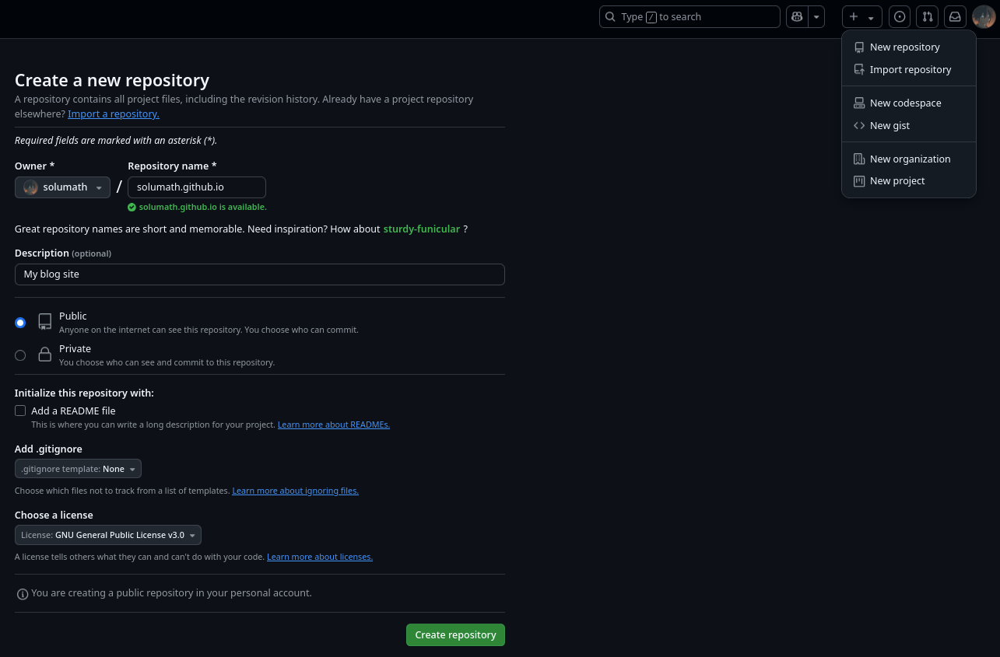
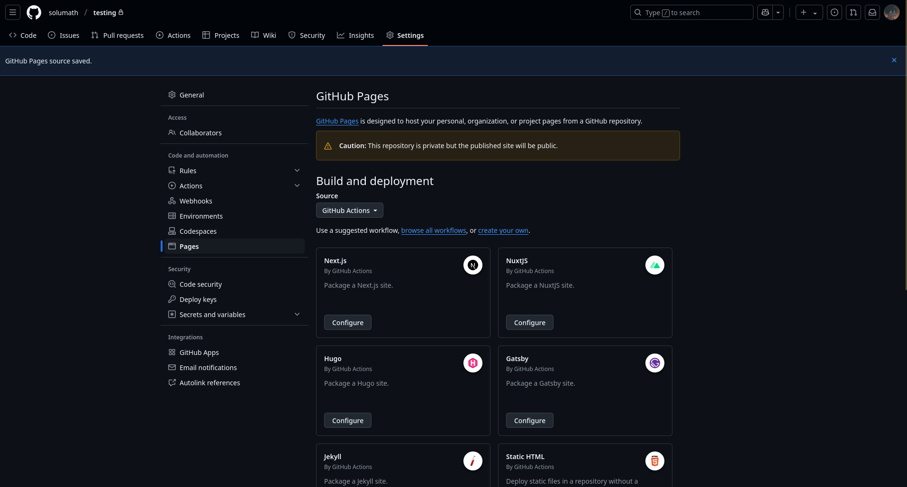

This is a step-by-step guide on how I created the blog you’re reading right now.

You can find all the code in my repo.


## Why Write a Blog?

Ever wanted to share your experiences or projects but weren’t sure where or how to start? That’s exactly how I’ve felt. I have been working on so many projects lately and I wanted to share a little bit of my experience.

I'm not a professional writer, but a professional "fuck stuff up" guy and believe me that happens more often than it should. Most of the time it pays off and I learn from these mistakes and that's why you are reading this.

If you’re setting up your own blog, don’t be afraid to fuck things up a bit. You’ll learn way more from experimenting than just following a guide on the internet.

## Blog Options

When I was considering writing my own blog my biggest priority was convenience. I wanted something that fit my workflow.

As I recently started using Obsidian I was looking into options how to take advantage of that.

Mostly I didn't want to be tied down by a specific format which would make transition to different format challenging in the future.

### Obsidian Publish

[Obsidian publish](https://obsidian.md/publish) is pretty nice if you want something that works out of the box. Is completely compatible with Obsidian and has some customisation.

Unfortunately it's a paid service of $8/month that is with yearly subscription, $10 if you go monthly. Maximum size of site is 4 GB.

I don't want to be bothered by limited size of my page or other specifications which I would need to tip toe around.

I agree that for most people this solution is okay. But if you want it cheap there's better way.

### Quartz

[Quartz](https://github.com/jackyzha0/quartz) is an open source alternative to Obsidian publish. It fully supports Obsidian and is customizable.

However customisation is harder and there is not that much community driven themes that I would find pleasing. The layout is similar to Obsidian vault which makes it impractical for blog site.

### Hugo

[Hugo](https://github.com/gohugoio/hugo) is an open source framework that generates static sites from markdown files. It is not fully Obsidian compatible but I chose it anyway.

I selected this framework for 4 key reasons:
- Open source -> I can see how the code works
- Generates static files -> can be hosted on GitHub pages
- Fairly popular -> easier to find resolution for problems
- Customisable with community themes

To be honest, setting up Hugo is easy but there are some obstacles and it is not plug and play. However, I was confident that I could make the most of its features and reach the desired result.

## Setting up Obsidian with Hugo

### Workflow

The process of writing blog is simple:
1. Write the post in Obsidian
2. Copy blog post using shell-commands plugin to a git repository
3. Generate content and check the outcome in browser
4. Push to GitHub
5. GitHub workflow will deploy the page automatically on push to main branch


%%{
	init: {
		'theme': 'base',
		'themeVariables': {
		'primaryColor': '#262626',
		'primaryTextColor': '#fff',
		'primaryBorderColor': '#69e1ff',
		'lineColor': '#fff',
		'tertiaryColor': '#fff'
		}
    }
}%%
graph TD;
A[Obsidian] --> B[Git Repository] --> C[Hugo] --> D[GitHub] --> E[GitHub Pages]


## Tools

- [Obsidian](https://obsidian.md/)
- [Hugo](https://gohugo.io/)
- [Git](https://git-scm.com/)
- [GitHub account](https://github.com/)

## Step by step

### Obsidian


Check [My Obsidian Setup](https://solumath.cz/posts/002-my-obsidian-setup/) before continuing here. I have summed my settings and plugins, which are necessary for the blog.


Using Hugo with Obsidian brings some limitations. So to have the least amount of work when publishing from Obsidian I follow these rules.

#### 1. Directory Structure

`Choose your blog structure`

Hugo supports 2 styles of directory structure.
1. Directory as a post where you need to supply `index.md`

```txt
├─ blog
   ├─ posts
	  ├─ 01-post-name
		 ├─ index.md
		 └─ images
		     └─ image-name.jpg
```

2. Single markdown files as a post
```txt
├─ blog
   ├─ posts
	  ├─ 01-post-name.md
	  └─ 02-post-name.md
```

Here I went with first option because it keeps assets together as I have images or other material for the posts.

Another tip is the numbering in front of post names for two things. First you will know how many posts you have. And second you know the order in which they came out and would have been difficult to filter later.

#### 2. Front Matter Template

`Every post must have a Front matter`

[Front matter](https://gohugo.io/content-management/front-matter/) is part of file which includes metadata used by Hugo to decide what to do with content. You can use [Templater](https://github.com/SilentVoid13/Templater) plugin for more complex templates but the integrated templates were good enough for me.

My blog template looks like this.
```yaml
---
title:
published: {{date}}T{{time}}
modified:
draft: true
summary:
tags:
---
```

For Hugo to parse the `published` metadata correctly you need to follow [dates format](https://gohugo.io/content-management/front-matter/#dates).

Here I encountered the first problem!

When publishing posts they won't appear if their time is in future. So let's say you provided the correct time and the post isn't on the blog. What now?

By default Hugo will make assumption that your time zone is UTC. This might be bothering because sometimes you just create a quick post or want to test something out and you don't see your post on the page.

To fix this you need to use `HH:mm:ssZ` for your time format. This will add your zone shift to the time.

#### 3. Naming Files

`Replace white chars in file names with dashes`

To avoid formatting problem when migrating Obsidian markdown to regular markdown I name my files so that any white chars are replaced with dashes.
That's because Obsidian uses char `%20` for white chars which are incompatible with regular markdown.

Example

From: `001 hello world.md`

To: `001-hello-world.md`

### GitHub Repository

Create repository with name `[your-name].github.io`.


And copy your repository.
```bash
git clone git@github.com:[your-name]/[your-name].github.io.git
```

### Hugo

Every Hugo theme has its own options how to install it. I use git modules since it is easy to update and there won't be conflicts with my changes.

For my page I used `Blowfish theme`. Follow their [installation guide](https://blowfish.page/docs/installation/).

After you are done you should have structure similar to this
```txt
.
├── assets
│   └── img
│       └── author.jpg
├── config
│   └── _default
├── content
│   ├── _index.md
│   ├── about.md
│   └── posts
│       └── _index.md
└── themes
    └── blowfish
```

Now all that's left is to copy our posts from obsidian to `content/posts`. You can do it with CLI or use the shell-commands plugin.
```bash
# macro for shell-commands
# {{!_blog_path}} is my custom defined variable 
cp -a {{!vault_path}}/[your-name].github.io/* {{!_blog_path}}/content/posts
```

Generate the content for Hugo using
```bash
hugo
```

Or if you want to run the server to see the changes
```bash
hugo serve
```

Both of these commands will create static content in public folder which you need to commit too.

Commit your changes after you are done
```bash
git add .
git commit -m "new post"
```

### GitHub Pages

For deploying our blog we will need our domain and server so users can see our website.

Fortunately GitHub has free service called [GitHub Pages](https://pages.github.com/) which offers you subdomain and server. Which is perfect for testing deployment for such project. This however comes with [limits](https://docs.github.com/en/pages/getting-started-with-github-pages/about-github-pages#limits-on-use-of-github-pages) as what your page can do:

1. Only static content, no databases or dynamic content. That means you can't have comments on your website if you later wanted to add them.
2. Site can't be larger than 1 GB.
3. Maximum bandwidth of 100 GB per month.
4. and more ...

#### 1. Create GitHub Page

To create GitHub page follow their [documentation](https://docs.github.com/en/pages).
For our use case we will change the workflow how to deploy the page.

When you setup your repository go to settings and change the Build and deployment source to GitHub Actions.


#### 2. Create GitHub Workflow

Follow the [Hugo documentation](https://gohugo.io/hosting-and-deployment/hosting-on-github/).

Here is copy of my workflow that makes sure that anytime I push the changes to `main` branch, the page will be rebuilt and pushed online.

Paste this into `.github/workflows/hugo.yaml`.



After you are done with changes you can just push it to GitHub
```bash
git add .
git commit -m "add hugo deployment"
```

### Push

After you committed all your changes and have the workflow setup. You can push your changes to your repository
```bash
git push
```

And after a while you should see your blog at <https://[your-name].github.io>.

# References

- <https://github.com/solumath/Blog>
- <https://obsidian.md/>
- <https://github.com/jackyzha0/quartz>
- <https://git-scm.com/>
- <https://github.com/>
- <https://docs.github.com>
- <https://gohugo.io/>
- <https://github.com/SilentVoid13/Templater>
- <https://blowfish.page/>
